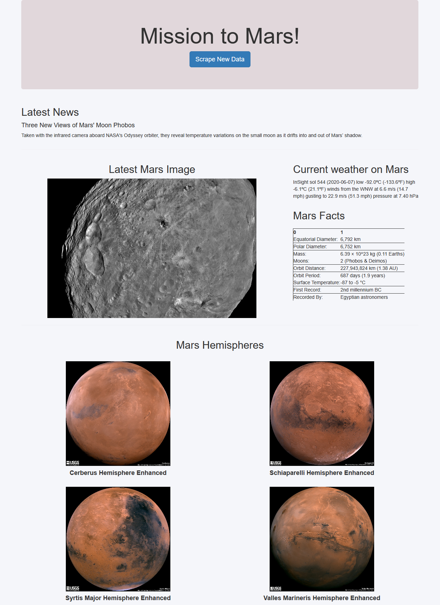

# web-scraping-challenge

In this challenge I was tasked with gathering a bunch of information on Mars using web scraping. 

I used a combination of Splinter and Beautiful Soup to gather the information. Then I created a basic web page using HTML, CSS, and Bootstrap that was hosted using a flask server. 

There's a button to refresh the information and perform the scrape again. It may be a little slow to run the scrape again, but it works! 

---
If you'd rather look at the page without refreshing it, here is a screenshot of the page. 

