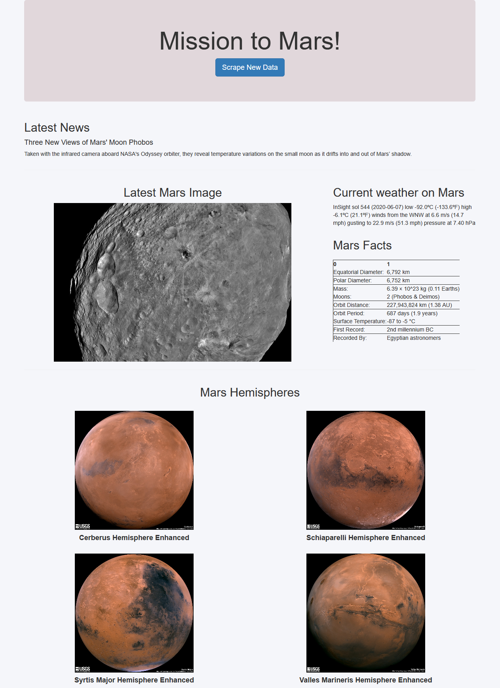

# web-scraping-challenge

In this challenge I was tasked with gathering a bunch of information on Mars using web scraping. 

Using a combination of Beautiful Soup and Splinter, I was able to scrape the images and data from various websites. 

There's a button to refresh the information and perform the scrape again. It may be a little slow to run the scrape again, but it works! 

---
If you'd rather look at the page without refreshing it, here is a screenshot of the page. 

